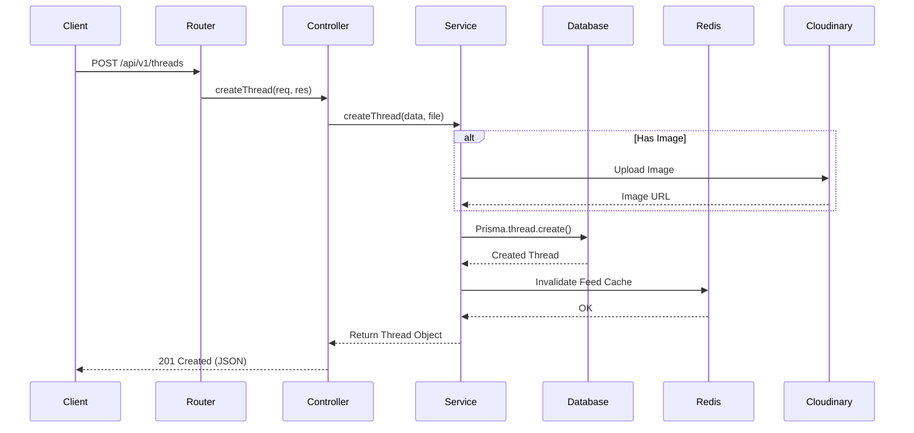

# Architecture Overview

This document describes the high-level architecture of the **Circle Backend**.

## System Design

The application follows a **Monolithic Architecture** using a layered structure. It is built to be modular within a single codebase, allowing for straightforward development and deployment while maintaining clear separation of concerns.

### Layers

1.  **Presentation Layer (Routes & Controllers)**
    *   **Routes**: Define the API endpoints and map them to specific controller functions.
    *   **Controllers**: Handle incoming HTTP requests, validate input (using Zod), and return HTTP responses. They delegate business logic to the Service layer.

2.  **Business Logic Layer (Services)**
    *   **Services**: Contain the core business rules and logic. They interact with the Data Access Layer and perform operations like user authentication, thread creation, and calculations.

3.  **Data Access Layer (Prisma ORM)**
    *   **Prisma Client**: Provides a type-safe interface to the PostgreSQL database.
    *   **Models**: Defined in `schema.prisma`.

4.  **Caching Layer (Redis)**
    *   Used for caching frequently accessed data (e.g., feed, user profiles) to reduce database load and improve response times.

5.  **External Services**
    *   **Cloudinary**: For storing and optimizing user-uploaded images (avatars, cover photos, thread images).

## Request Flow

The following Mermaid diagram illustrates the flow of a typical request (e.g., creating a thread):

## Directory Structure

Key directories in `src/`:

- **`v1/`**: Contains version 1 API resources.
    - Uses a feature-based or resource-based grouping (implied to be checked further, but standard practice).
- **`config/`**: Configuration files (Redis connection, Cloudinary setup).
- **`prisma/`**: Database schema and migrations.
- **`swagger/`**: API documentation configuration.

## Key Technologies

- **Express.js**: Web app framework.
- **Prisma**: Next-generation ORM for Node.js and TypeScript.
- **Redis**: In-memory data structures store, used as database, cache, and message broker.
- **Zod**: TypeScript-first schema declaration and validation library.
