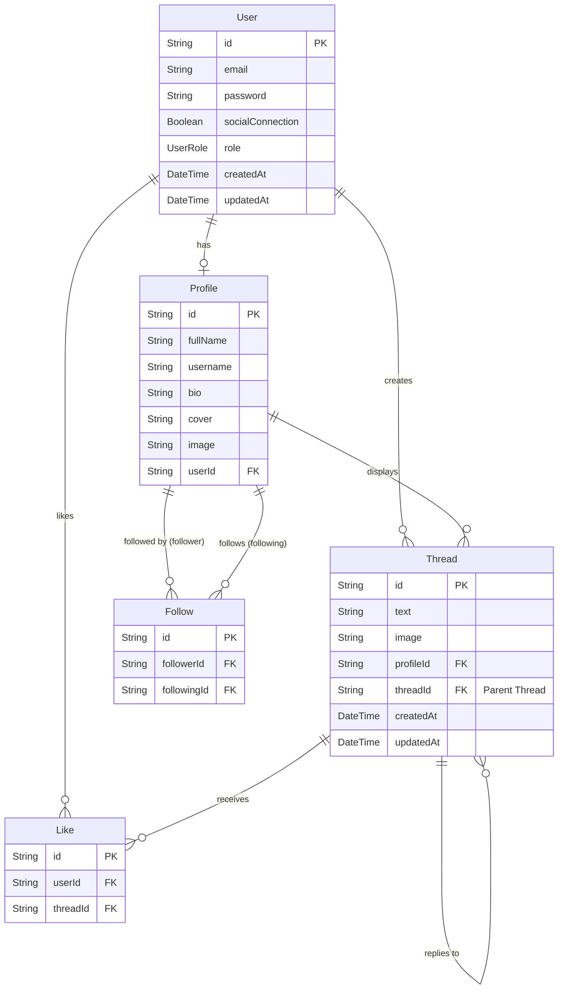

# Database Schema

The application uses **PostgreSQL** as the primary relational database, managed via **Prisma ORM**.

## Entity Relationship Diagram

The following diagram represents the relationships between the core models: `User`, `Profile`, `Thread`, `Follow`, and `Like`.

## Models Description

### User
Represents the authentication account.
- **id**: Unique identifier (UUID).
- **email**: Unique email address.
- **password**: Hashed password.
- **role**: `ADMIN` or `USER`.

### Profile
Public-facing profile information.
- **userId**: One-to-one relation with User.
- **username**: Unique handle.
- **fullName**: Display name.
- **bio**, **image**, **cover**: Profile customization.

### Thread
A post or a reply.
- **text**: Content of the post.
- **image**: Optional attachment.
- **threadId**: If present, this is a reply to another thread (self-referential relation).
- **profileId**: The author.

### Follow
Represents the social graph.
- **followerId**: Who is following.
- **followingId**: Who is being followed.

### Like
Represents a user liking a thread.
- **userId**: Who liked.
- **threadId**: What was liked.
